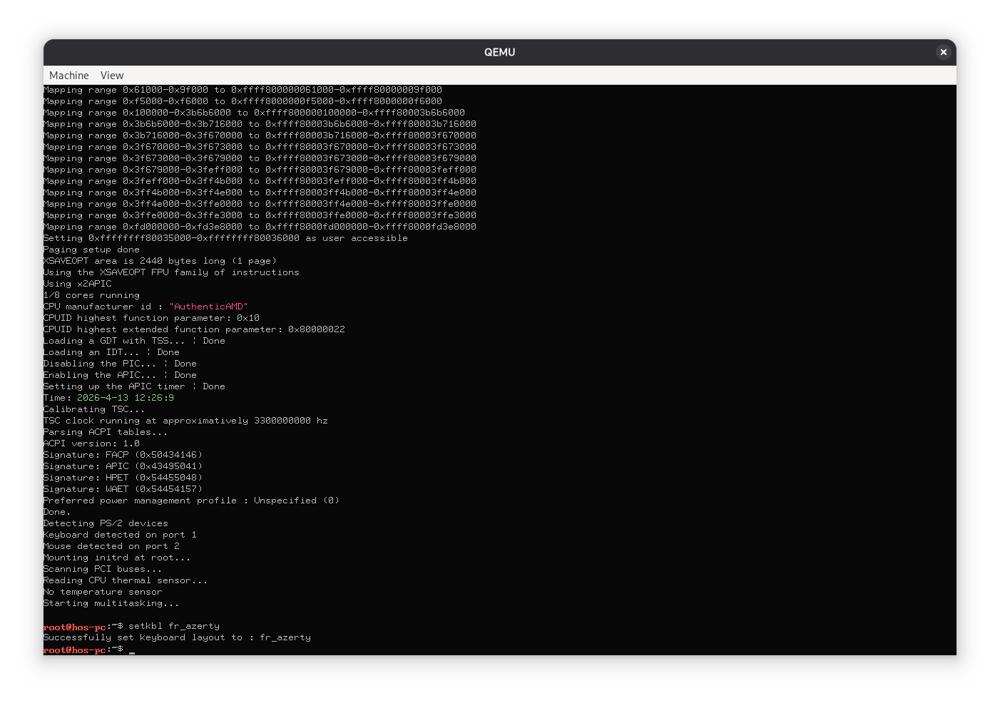
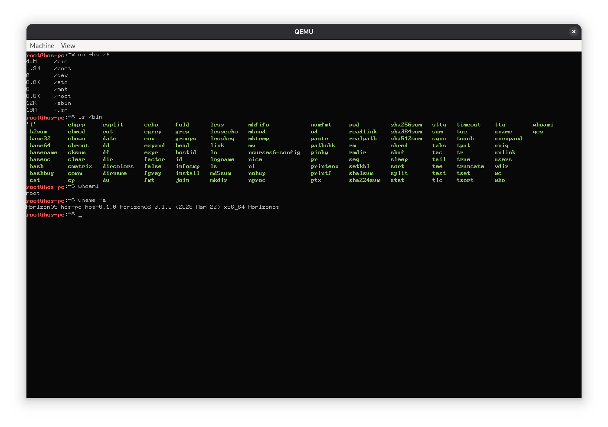
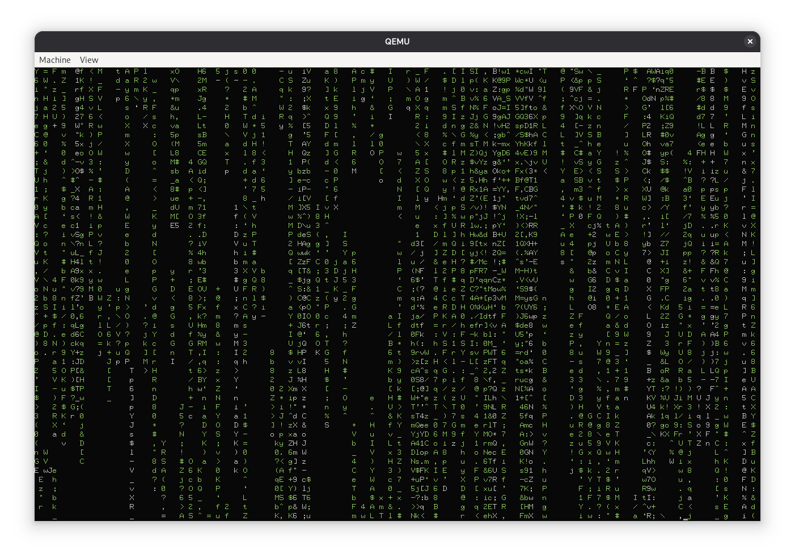

# HorizonOS

<div align="center">
   
    
    
   
   
   
</div>

HorizonOS is a simple unix-like monolithic kernel for the x86-64 architecture.

## Screenshots







## Building HorizonOS

These instructions assume a Debian-like environment. Feel free to adapt those instructions to other platforms.

### Prerequisites

Install dependencies:
```bash
sudo apt install -y build-essential bison flex libgmp3-dev libmpc-dev libmpfr-dev texinfo nasm xorriso mkbootimg util-linux dosfstools mtools qemu-system qemu-utils unzip autoconf2.69 zip meson aptitude autopoint gperf
sudo aptitude install ovmf -y
```

### Building

run:
```bash
make USER_CFLAGS="${options}"
```
Here's a (non exhaustive) list of the supported options:
| Option | Value   | Description |
| ------ | ------- | ----------- |
| -DNDEBUG | N/A | Disable assertions. Might make the kernel run smoother depending on the configuration |
| -DLOG_LEVEL | ={TRACE, DEBUG, INFO, WARNING, ERROR, CRITICAL} | Level from which logs are written to port 0xe9 |
| -DLOG_SYSCALLS | N/A | Whether to log syscalls |
| -DLOG_MEMORY | N/A | Whether to log page allocation |
| -DLOG_TO_TTY | N/A | Write logs to the screen instead of port E9 |
| -DNO_STDOUT | N/A | Disable text output (but keep log output if LOG_TO_TTY is specified) |
| -DDEBUG_ALLOCATOR | N/A | Enable a simple memory allocator (doesn't even allow for freeing pages, should never be used in practice) |
| -DIGNORE_ANSI | N/A | If set, all ANSI control sequences will be ignored |
| -DPRINT_UNRECOGNIZED_ANSI | N/A | If set, will print any unsupported escape sequence to the screen |
| -DTTY_CURSOR_BLINK | N/A | If set, the terminal cursor will blink. If not, it will be a solid white color |
| -DPRINT_PCI_INFO | N/A | Whether to print the pci devices list |
| -DPRINT_MLIBC_LOGS | N/A | If set, mlibc's logs will be printed to the screen. If not, they will only be logged to port e9 |

For example to build with LOG_LEVEL=TRACE, LOG_SYSCALLS and NDEBUG:
```bash
make USER_CFLAGS="-DLOG_LEVEL=TRACE -DLOG_SYSCALLS -DNDEBUG"
```
Or to build in "Release" mode:
```bash
make USER_CFLAGS="-DNDEBUG"
```

A `horizonos.iso` disk image file will be created in the root of the repository.

### Running HorizonOS

To run HorizonOS in QEMU:
```bash
make run
```

## Third-Party Code

HorizonOS uses the following third-party libraries and resources:

- [liballoc](https://github.com/blanham/liballoc) - For memory allocation (Public domain)
- [pci.ids](https://raw.githubusercontent.com/pciutils/pciids/refs/heads/master/pci.ids) - List of PCI IDs (GPLv3)
- [limine](https://codeberg.org/Limine/Limine) - Bootloader
- [catppuccin for limine](https://github.com/catppuccin/limine) - Limine theme (MIT)

## Contributing

You can submit issues [here](https://github.com/EtienneMaire37/HorizonOS-v5/issues).

## License

HorizonOS is licensed under the GNU GPLv3 License. See the `LICENSE` file for more details.
